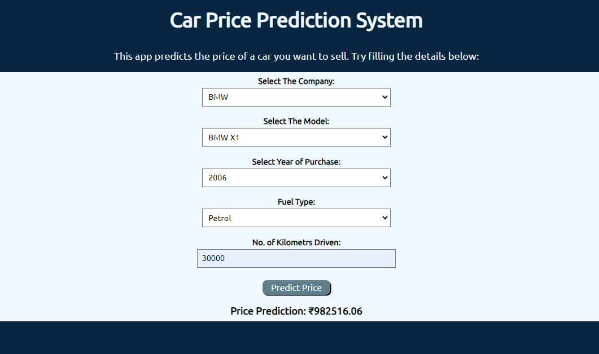
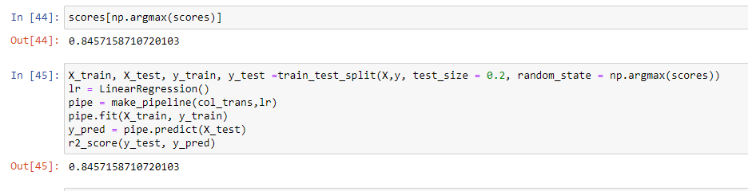

# Car_Price_Prediction_System
This is an end-to-end Car Price Prediction System, made using Linear Regression and Flask for the backend and HTML, CSS, and JavaScript for the frontend. The system provides accurate car price estimates based on user input and historical data. 
## Web Page

## Accuracy:

